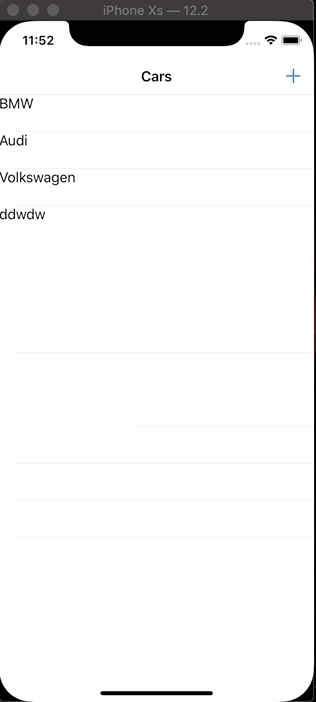

## Add Table View Row 
- **Feature** add a custom tablw view row from a differnt segue 

- **Stack** xcode 10.2 swift 5

- **Takeaway** 
        - uibutton > attributes inspctor > system item > deault buttons

### send data from add table VC
```Swift
// this action is linked to a button on diff VC
// click on the button + cntrol and fimd the 3rd thing next to yellow moon AKA EXIT


@IBAction func done(segue:UIStoryboardSegue) {
let carDetailVC = segue.source as! CarDetailViewController
newCar = carDetailVC.carTestField.text ?? "lmfr"

cars.append(newCar)
carTableView.reloadData()
}

```


<!--[Visit Project](https://github.com/YasinEhsan/TableViewAddRow) -->


